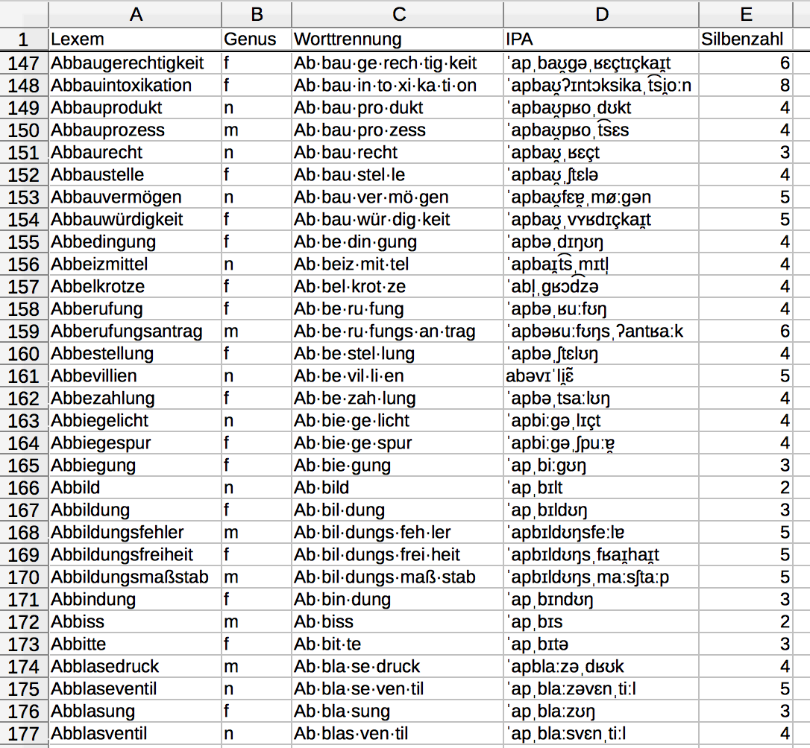

# WikiWords: A Wiktionary-based collection of linguistic resources

## About WikiWords
The aim of this project is to make data from <a href="https://www.wiktionary.org/" target="_blank">Wiktionary</a> available in a simple spreadsheet format as an easy-to-use resource for semi-automatic linguistic annotation. It is work-in-progress, and currently only a preliminary dataset of German nouns - containing information about their grammatical gender as well as a transcription in IPA - is available. 

Please note that the datasets made available here can contain all kinds of mistakes. Their purpose is to aid manual annotation, not to replace it. All results obtained using WikiWords should be checked carefully.

WikiWords is a project by Peeter Tinits and Stefan Hartmann. All data are available under a CC-BY-SA-4.0 license. If you use WikiWords, please give attribution to the Wiktionary project. If you find the WikiWords database helpful, we'd be happy if you quoted it as:

Tinits, Peeter & Stefan Hartmann: WikiWords. A Wiktionary-based collection of linguistic resources. https://github.com/hartmast/WikiWords.

The WikiWords logo is based on the <a href="https://commons.wikimedia.org/wiki/File:WiktionaryEn.svg" target="_blank">Wiktionary logo</a> by Wikimedia Foundation, Inc., used and distributed here under a CC-BY-SA license.

 

## Datasets

### WikiNounsDe (German nouns)

WikiNounsDe can be downloaded <a href="https://github.com/hartmast/WikiWords/raw/master/wikinouns_DE.csv" target="_blank">here</a> (3.8 MB). It is a simple csv sheet comprising 71,977 words in total and containing the following columns:
* **Lexem**: the lexeme in question (nominative singular)
* **Genus**: the grammatical gender of the lexeme in question. (f = feminine, m = masculine, n = neuter; lexemes that can have more than one gender are tagged as fm, fn, mn, etc.)
* **IPA**: IPA transcription. In some cases, two transcriptions are given, separated by \|.
* **Worttrennung**: Syllabification.
* **Silbenzahl**: Number of syllables, automatically calculated from the syllabification column.

 

## Processing resources

### WikiNounsDe processing resources

The WikiNounsDe dataset was created from <a href="https://dumps.wikimedia.org/dewiktionary/20190301/dewiktionary-20190301-pages-articles.xml.bz2" target="_blank">this</a> Wiktionary dump using the R script wiktionary_process.R. To ensure that every word occurs only once, duplicate entries were manually checked (see check_duplicates_checked.csv). In the case of duplicates due to the coexistence of homographic native and non-native nouns, only the native variant was taken into account. If several native variants with different pronunciations co-exist, they were merged by considering both variants in the IPA column and seperating them by \|.

 

